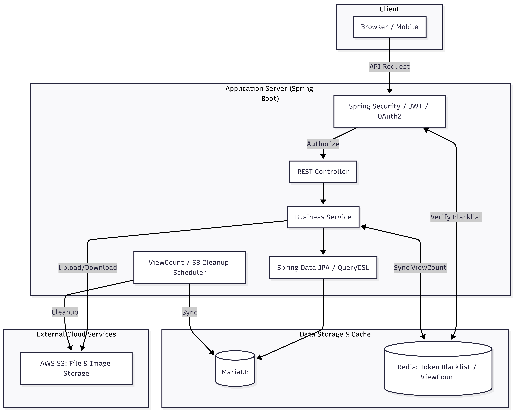
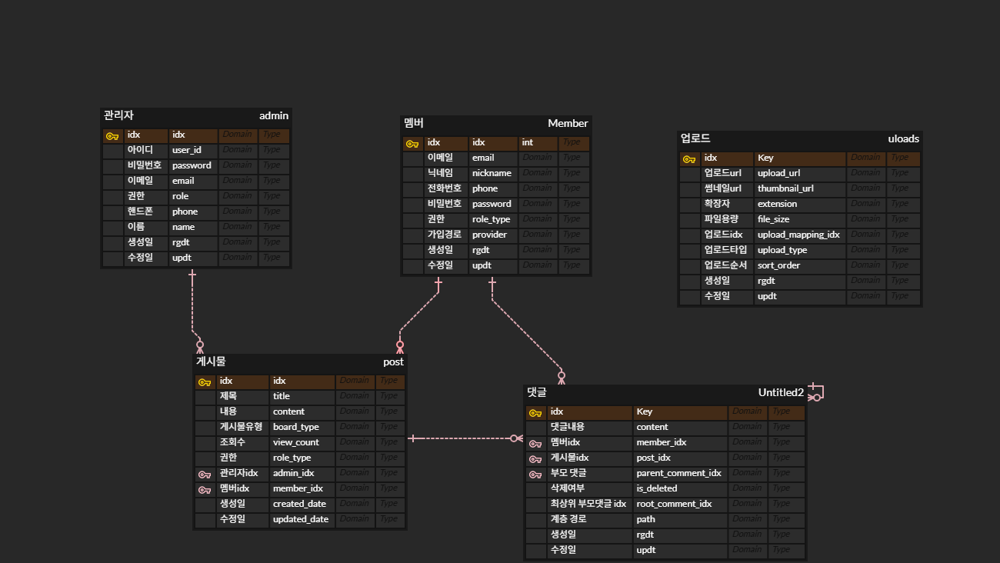

# 🚀 Spring Boot 기반 커뮤니티 게시판 서비스 (Backend API)

> **확장성과 보안을 고려한 현대적인 커뮤니티 백엔드 시스템**
>
> 단순히 기능을 구현하는 것을 넘어, 대용량 트래픽에서의 데이터 정합성, 보안 로직의 견고함, 그리고 유지보수하기 좋은 아키텍처를 고민하며 개발했습니다.

---

## 🛠 Tech Stack

### Backend
- **Framework:** Spring Boot 3.5.9
- **Language:** Java 17
- **Security:** Spring Security, JWT, OAuth2 (Social Login)
- **Data:** Spring Data JPA, **QueryDSL 5.0** (Dynamic Query)
- **Database:** MariaDB
- **Cache/NoSQL:** **Redis** (Token Blacklist, View Count Optimization)
- **Storage:** AWS S3 (Image & File Upload)

### Tools & DevOps
- **Build:** Gradle
- **API Docs:** Swagger (SpringDoc 2.8.5)
- **Logging:** Logbook (Request/Response Tracking)

---

## 🌟 Key Features & Technical Achievements

### 1. 보안 및 인증 아키텍처 (JWT + OAuth2 + Redis)
- **JWT & Social Login:** OAuth2(Google, Kakao 등)와 자체 JWT 인증을 통합하여 유연한 로그인 환경 구축.
- **로그아웃 블랙리스트:** Redis를 활용하여 로그아웃된 Access Token을 블랙리스트로 관리, 유효기간 내 토큰 탈취 위험 원천 차단.
- **권한 계층화:** Role-based Access Control (USER, ADMIN)을 통해 API 접근 제어.

### 2. 성능 최적화 (Redis & Scheduling)
- **조회수 중복 방지 및 성능 개선:** 게시글 조회 시마다 DB Update 쿼리가 발생하는 병목 현상을 해결하기 위해, **Redis에서 조회수를 캐싱하고 스케줄러를 통해 배치로 DB에 반영**하는 로직 구현.
- **QueryDSL 활용:** 복잡한 검색 조건(제목, 내용, 작성자 등)과 페이징 처리를 QueryDSL을 통해 타입 안정성이 보장된 동적 쿼리로 구현.

### 3. 클라우드 인프라 활용 (AWS S3)
- **이미지 업로드 시스템:** AWS S3와 연동하여 멀티파트 파일 업로드 구현.
- **썸네일 생성:** `Thumbnailator`를 활용하여 원본 이미지 업로드 시 자동 썸네일 생성으로 트래픽 비용 절감.
- **S3 Cleanup 스케줄러:** DB에 저장되지 않은 임시 업로드 파일이나 삭제된 게시글의 파일을 주기적으로 정리하는 스케줄러 구현.

### 4. 에러 핸들링 및 로깅
- **전역 예외 처리:** `@RestControllerAdvice`와 커스텀 `ExceptionType`을 통해 일관된 에러 응답 포맷(JSON) 제공.
- **API 추적성:** `Logbook`을 도입하여 모든 HTTP 요청과 응답을 로깅, 장애 대응 및 디버깅 효율성 증대.

---

## 🏗 Architecture Diagram

---

## 📊 Database ERD

[👉 ERDCloud에서 자세히 보기](https://www.erdcloud.com/d/cKkYMpKqHmGizHDKR)
---

## 📖 API Documentation
- **Swagger UI:** `http://localhost:8090/swagger-ui/index.html` (local 실행 시)
- 모든 API는 표준 HTTP Method와 상태 코드를 준수하며, 상세한 요청/응답 타입이 정의되어 있습니다.

---

### 📝 작성자
- **성보현 (Bohyun Sung)**
